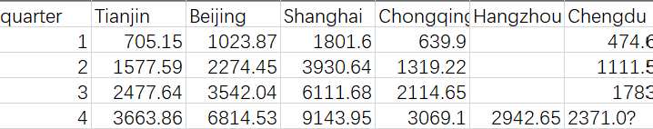

# 消费券的发放方案设计与效益评估

Author @zzeshen

Date: 2020-08-17

---
## 问题重述

1. 结合[参考文献](./消费券的发放理念_运作方式与政策_省略_应_基于杭州教育培训消费券的实践_周旭霞.pdf)给出的消费券的运作方式，针对不同城市的经济发展水平、居民消费习惯、环境地理条件等因素，定量评价不同发放方式在刺激经济上的作用与效果；
2. 与其他国家（地区）政府直接向市民发放现金相比，定量比较两种方式对经济复苏的作用与效果，研究其可持续性；
3. 以南京市为例，设计一个5亿元消费券的发放方案，尽可能使所获得的经济与社会效益最大；
4. 请设计一种其他的刺激经济发展的方式，并评估所设计方法的效果。

## 针对问题一

为了更好的定量描述消费券发放前后对经济发展的影响情况，我们构建了
$$
回报效率\eta={地区生产值增幅\Delta w\over政府投入金额P}
$$
统计量，通过比较计算得到的回报效率评估一种发放消费券是否有效。

其中，地区生产总值增量是指实际发放消费券后的地区生产总值（W_real）与通过之前数据预测出的地区生产总值（W_pred）之差，即
$$

$$
由于预测数据的训练集数据集的数据量严重不足，且大部分数据为季度累加数据（*即按季度进行逐季度累加，便于计算年地区生产总值*），部分城市的早期数据有且仅有年终数据（第四季度）而缺失了极度累加数据，但近几年的数据是齐全的，搜集到的数据均形如下面的表格所示：

为了解决上面数据存在的问题，我们提出以下数据处理逻辑：

1. 对于齐全的累加数据，将其还原成正常的按季度划分数据；
2. 对于早期数据只有年度数据、但近期数据（尤其是2019年）数据较全的累加数据，通过计算2019年度各季度经济产值所占全年的经济总产值比例，估算前期各季度的地区经济产值，并添加一个随机项产生一定的随机噪声，以便更好地模拟世纪情况。

基于上述思路，我们有`src\dataProcessor.m`如下：
```matlab
function data = dataProcessor(filePath)
    %dataProcesspr - Description
    %
    % Syntax: data = dataProcessor(filePath)
    %
    % Long description
    % enter the data's path and should return a dataset formated as a '.mat' file.
    % - filepath : path of file.
    % - data: should return to __main__() function a table named by 'data'.
    fprintf('GENERATING REQUIRED DATA...\n');
    opts = detectImportOptions(filePath);
    opts.Encoding = 'UTF-8';
    opts.PreserveVariableNames = true;
    tempdata = readtable(filePath, opts);
    [y, x]size(tempdata);

    data = [];

    for i = 2:x

        if isnan(tempdata(i, 1))
            sumNum = sum(tempdata(i, y - 3:));
            prox1 = tempdata(i, y - 3) / sumNum;
            prox2 = tempdata(i, y - 2) / sumNum;
            prox3 = tempdata(i, y - 1) / sumNum;
            prox4 = tempdata(i, y) / sumNum;

            for j = 1:y

                for l = 1:4
                    randNoise = 0.1 * randn;

                    if l == 1
                        data(j, i) = tempdata(j + 3, i) * prox1 * (1 + randNoise);
                    elseif l == 2
                        data(j, i) = tempdata(j + 2, i) * prox2 * (1 + randNoise);
                    elseif l == 3
                        data(j, i) = tempdata(j + 1, i) * prox3 * (1 + randNoise);
                    else
                        data(j, i) = tempdata(j, i) * prox4 * (1 + randNoise);
                    end

                end

            end

        else

            for j = 1:y
                k = 4;

                for k = 1:4

                    if k == 1
                        data(j, i) = tempdata(j, i);
                    else
                        data(j, i) = tempdata(j, i) - data(j - 1, i);

                    end

                end

            end

        end

    end

```
该函数充分考虑了可复用性，能够对规定格式的数据进行初步处理，并将处理结果以表的形式返回给主函数。

接下来对数据利用SARIMA模型进行预测，我们选取